# Resolve

A customer-support platform (tickets, customers, team, reports and a knowledge base) built from a complete Figma design, with a focus on accessibility, responsive behaviour and a shared component library. The interface is in Spanish.

[](https://github.com/Yelison/resolve/actions/workflows/ci.yml)

> **Status:** ready to deploy as a public demo, **not deployed yet**. The design system, the shared components (internally called **Forma UI**), the application shell and every area of the product are done, views and Spring Boot API: **Overview**, **Tickets**, **Customers**, **Team**, **Reports**, **Knowledge base** (reading and editing) and **Settings** (company, profile, appearance and the permissions matrix). Sign-in goes through OpenID Connect (the API is the client and keeps the session), one Docker image serves the API and the web app, and the pipeline is written, and the demo's Keycloak, the nightly reset and the runbooks were rehearsed locally; the pipeline stays switched off until the owner creates the Fly.io and Neon accounts (see [Live demo](#live-demo)). Still pending: tags, attachments and SLA for tickets, and article ratings; none of them is drawn as if it worked.

| Ticket inbox | Ticket detail (dark) |
| --- | --- |
| 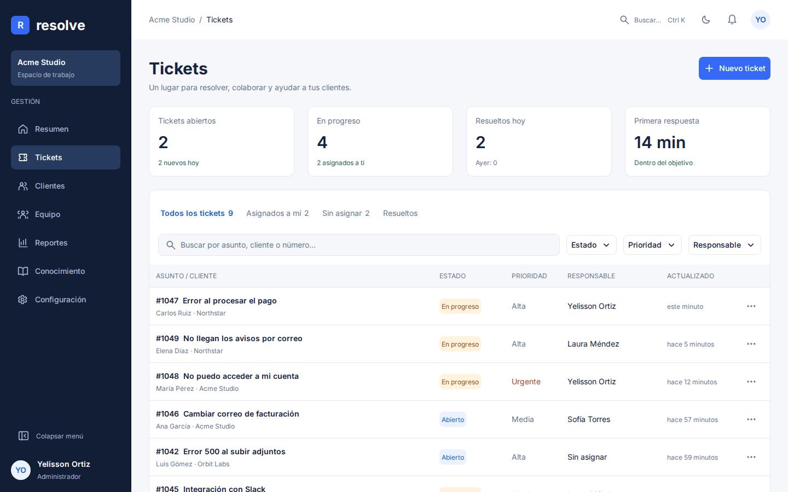 | 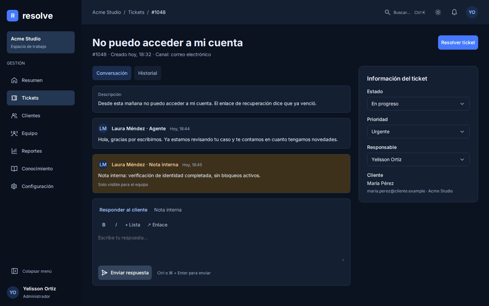 |

| Customers | Customer detail (dark) |
| --- | --- |
| 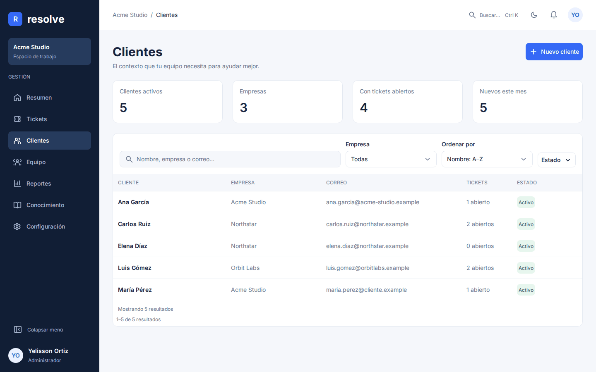 | 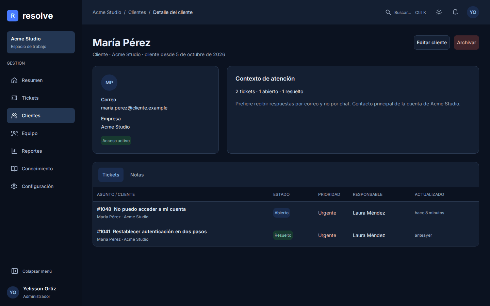 |

| Overview | Reports (dark) |
| --- | --- |
| 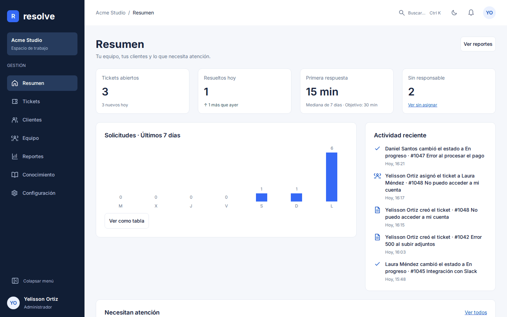 | 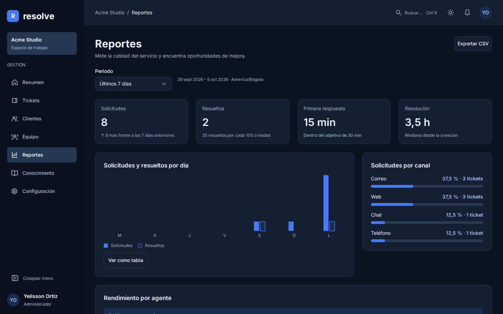 |

| Team | Settings |
| --- | --- |
| 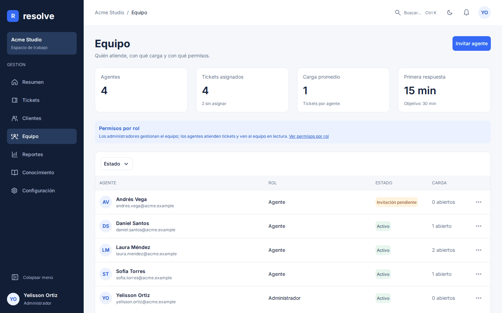 | 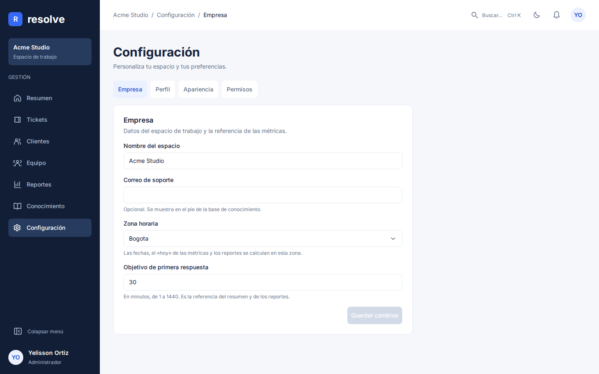 |

| Knowledge base | Article |
| --- | --- |
| 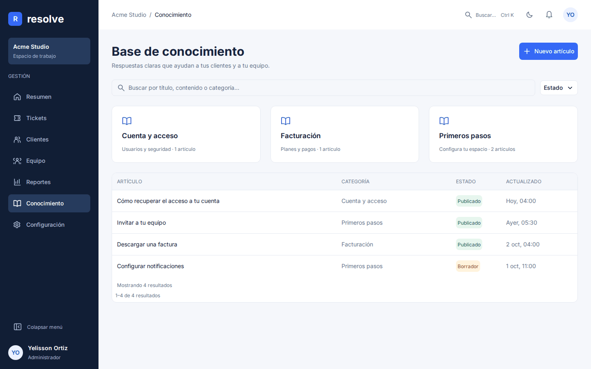 | 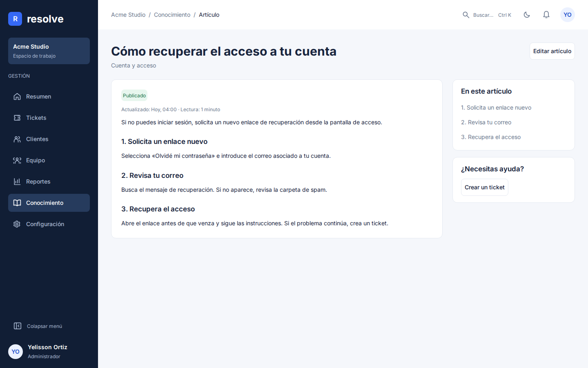 |

| Component catalog (`/catalogo`) | Mobile drawer (dark) |
| --- | --- |
| 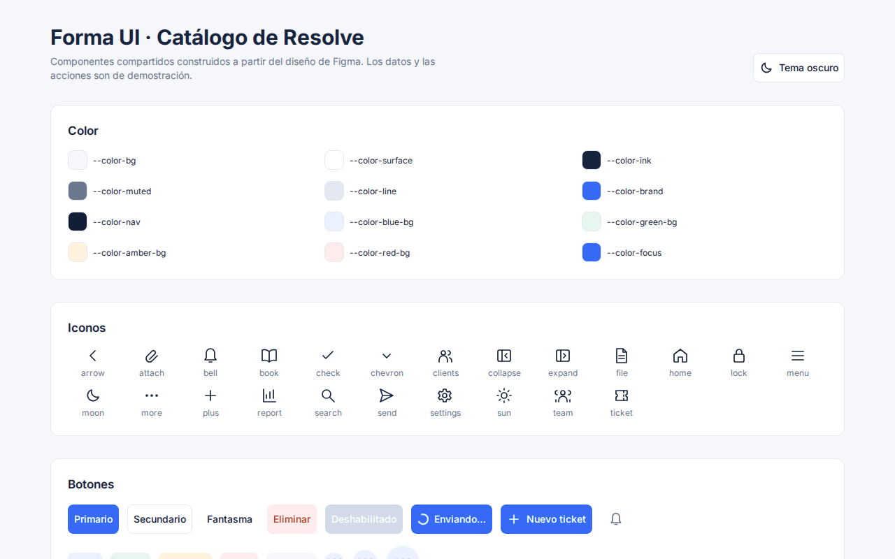 | 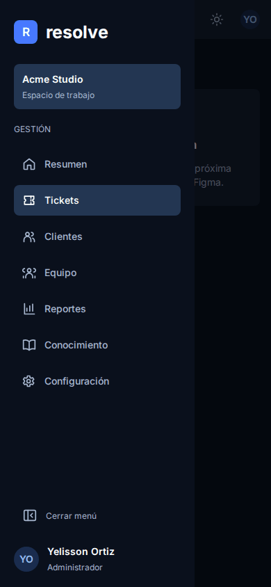 |

| Ticket table adapting to its container, from the catalog (dark) |
| --- |
| 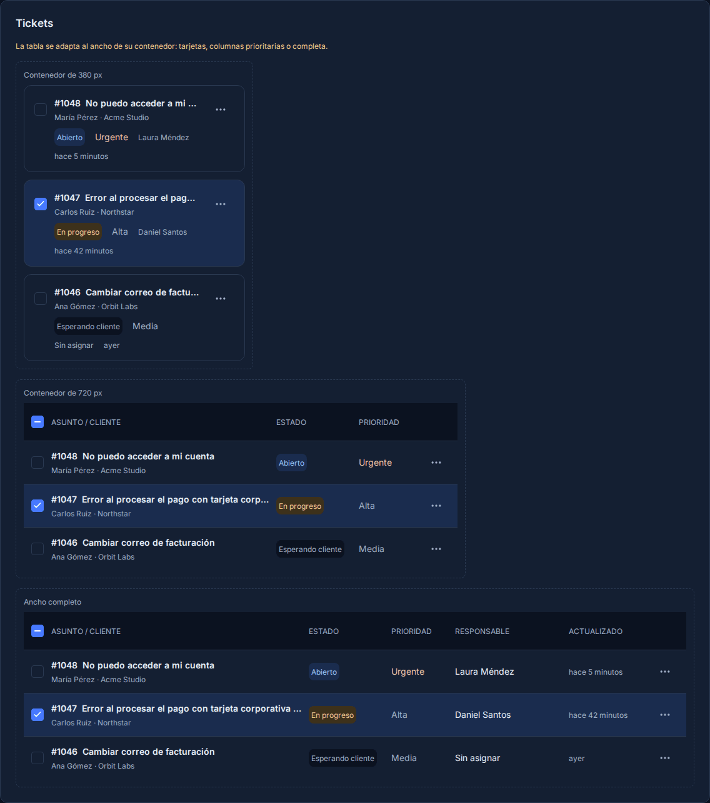 |

## Stack

| Layer | Technology |
| --- | --- |
| Frontend | React 19, TypeScript (strict), Vite 8 |
| Server state | TanStack Query |
| Routing | React Router 7 |
| UI | Forma UI: in-house components in `frontend/src/components/ui`, CSS Modules and design tokens |
| Backend | Java 25, Spring Boot 4, Spring Data JPA, Flyway |
| Database | PostgreSQL 17 |
| Quality | Vitest + Testing Library, Playwright, oxlint, Prettier, GitHub Actions, Dependabot |

## Highlights

- **Contract-first API.** [`docs/api/openapi.yaml`](docs/api/openapi.yaml) is the single source of truth: the backend integration tests validate every response against it (extra fields fail, so entities or internal notes cannot leak) and the frontend generates its TypeScript types and typed client from it. The decisions behind it are in [`docs/api/README.md`](docs/api/README.md).
- **Multi-organization by construction.** The organization always comes from the authenticated principal; composite foreign keys keep every reference inside one organization, foreign ids look exactly like missing ones, and customers only see their own tickets and public messages.
- **Safe concurrent edits.** Tickets carry an `ETag`; updates are merge-patches with `If-Match`, so a stale edit gets `412` and the UI reloads instead of overwriting someone else's change. Each change and its activity entry are written in the same transaction.
- **Design tokens that start in Figma.** Colors (light and dark), spacing and type styles come from the Figma variables into [`tokens.css`](frontend/src/styles/tokens.css), and the 23 icons into typed path data, by an export tool that runs inside Figma (kept outside this repository). A few values were adjusted in the code on purpose (contrast, hover and link colors, the progress track: issues #14, #65 and #75), are marked in the file and are protected by a contrast test. Dark mode is a pure token swap that follows `prefers-color-scheme` unless the user picks a theme, and an inline script applies the choice before the first paint.
- **Accessible by construction.** Components follow the WAI-ARIA Authoring Practices: menu button, tabs, toolbar, dialogs on native `<dialog>` (focus trap, Escape, focus return), tooltips that also appear on focus and can be dismissed (WCAG 1.4.13), labelled fields with announced errors, 44 px touch targets on small screens, a skip link and `prefers-reduced-motion`.
- **Responsive by content, not by device.** Two breakpoints (768 and 1200 px) drive the shell: a drawer on mobile, an icon sidebar on tablets and a collapsible sidebar on desktop. The customer and team tables share one layout built on container queries: cards in narrow containers, priority columns from 768 to 1199 px and the full table from 1200 px. The ticket table has its own container-query layout and is not guaranteed to behave the same at every width (at 1024 px it already shows all its columns).
- **Honest UI.** No fake success states: actions without a backend say they are not connected yet, and demo data is labelled as such.
- **Tested** (counts as of 2026-10-06). 1060 unit and component tests with coverage thresholds; 694 backend tests, most of them integration tests on PostgreSQL (Testcontainers), covering organization isolation, permissions, internal notes, filters, pagination, validation, update conflicts, metrics, transactional rollback and concurrency with real threads (ticket numbering, racing edits and replies), with a check that fails the build when an operation of the contract has no validated response; and 673 Playwright tests (mocked API) for every area, from the ticket flow to the article editor and the settings tabs, with layout checks at 320–1440 px (no layout shift when data arrives), table layouts at 390, 1024, 1200 and 1440 px, drawer focus, the persisted sidebar and horizontal overflow at 320–1440 px (including the 767/768 and 1199/1200 edges) in both themes, plus 6 full-stack smoke scenarios against the real API.

## Forma UI

Forma UI is the in-house component library in `frontend/src/components/ui` (one folder per component, with CSS Modules, design tokens, tests and JSDoc on every prop). The living catalog at `/catalogo` shows each one with demo data, and a test fails if an exported component is missing from it. The criteria for extracting it into its own package are in [ADR 0001](docs/decisions/0001-forma-ui-extraction.md).

- **Actions and feedback:** Alert, Button (and IconButton), Toast, Tooltip, Modal, Menu
- **Forms:** Input, Textarea, Select, Combobox, SearchField, Checkbox, Radio, Switch, Upload, Editor (ticket and article), Field (shared label, hint and error)
- **Navigation:** Breadcrumb, NavItem, Pagination, Tabs, Sidebar, Topbar
- **Data and content:** Avatar, Badge, Attachment, BarChart, EmptyState, FilterChip, Message, Metric, ProgressBar, Skeleton, Table, TicketRow (TicketTable), Timeline
- **Icons:** Icon, a single family of 20–24 px icons

## Project structure

```
docs/api/           # API decisions and the OpenAPI 3.1 contract
docs/decisions/     # Architecture decision records (Forma UI extraction criteria)
docs/deploy/        # Deployment guide and operations runbooks: backups, restore, rollback, secret rotation, health
docs/development/   # How to work on several tasks in parallel with Herdr
frontend/
  src/
    api/            # Types generated from the contract and the typed client
    app/            # Shell, routes, pages, theme and the /catalogo route
    components/ui/  # Forma UI: one folder per component (tsx, module.css, tests)
    features/       # Product features (tickets, customers, team, session…): pages, queries and their tests
    domain/         # Domain types, re-exported from the generated contract types
    lib/            # Small helpers (positioning, formatting, scroll lock, mutation errors, focus…)
    styles/         # Design tokens (from Figma, a few adjusted in code) and global styles
  e2e/              # Playwright specs with a contract-typed mock API
backend/
  src/main/java/com/resolve/api/
    common/         # Shared infrastructure only: errors, security, paging, persistence, time
    organizations/ memberships/ customers/ tickets/   # One package per feature
  src/main/resources/db/migration  # Flyway schema; db/demo holds dev-only demo data
deploy/             # Fly.io config, Keycloak (realms, login theme, image) and the production compose to test the image
Dockerfile          # One image: API + web app
docker-compose.yml  # PostgreSQL and Keycloak for local development
```

## Getting started

Requirements: Node 22.12+, Java 25 and Docker (for PostgreSQL, Keycloak and the backend tests).

```sh
# Frontend
cd frontend
npm ci
npm run dev            # http://localhost:5173 (component catalog at /catalogo)

# Database and API
docker compose up -d   # from the repository root; POSTGRES_PORT=5433 if 5432 is taken
cd backend
SPRING_PROFILES_ACTIVE=dev ./mvnw spring-boot:run   # http://localhost:8080/api, proxied by Vite at /api
```

To run the web app and the API as one process on one origin (what a deployment does), build the frontend, copy it into the backend's static resources and package without `clean`:

```sh
cd frontend && npm run build
mkdir -p ../backend/target/classes/static && cp -r dist/. ../backend/target/classes/static/
cd ../backend && ./mvnw -B -DskipTests package && SPRING_PROFILES_ACTIVE=dev java -jar target/*.jar   # app at http://localhost:8080/, API at /api
```

Any path that is not a file and does not start with `api/` or `actuator/` answers `index.html`, so reloading `/tickets/1047` works; `/assets/**` (hashed files) is cached for a year and `index.html` is never cached. `frontend/dist` is not committed. During development nothing changes: Vite serves the app and proxies `/api`.

The API reads `DATABASE_URL`, `DATABASE_USERNAME` and `DATABASE_PASSWORD`, with defaults that match `docker-compose.yml` (development only). The `dev` profile alone loads demo data and a demo login (the `X-Demo-User` header, defaulting to the demo admin); adding `oidc` turns on real sign-in against the local Keycloak (see [Sign in locally](#sign-in-locally)), and any profile without either answers `401`. See the [API contract](docs/api/README.md).

To try other roles in development, call `setDemoUser` from the browser console, for example for the customer María Pérez: `setDemoUser('maria.perez@cliente.example')` (agents: `laura.mendez@acme.example`; `setDemoUser(null)` goes back to the admin). It replaces setting `resolve-demo-user` in `localStorage` by hand and also empties the query cache so data from the previous user never shows; reload the page to load the new session. The same switch is in the account menu (top right, «Cambiar usuario de demostración») and, when the API answers `401`, on the `/entrar` page; both exist only in the dev server and the `smoke` build, never in `production`.

### Sign in locally

`docker compose up -d` also starts a local [Keycloak](https://www.keycloak.org/) (image `quay.io/keycloak/keycloak:26.7.5`, pinned to the last patch of the 26.7 series when this was written; never `latest`) that imports the realm in [`deploy/keycloak/resolve-realm.json`](deploy/keycloak/resolve-realm.json). It is the identity provider of the backend's `oidc` profile and it is for local development only.

```sh
docker compose up -d keycloak   # KEYCLOAK_PORT=8182 if 8180 is taken
curl http://localhost:8180/realms/resolve/.well-known/openid-configuration

# Backend as an OpenID Connect BFF with the demo data (dev) and Keycloak (oidc)
cd backend
SPRING_PROFILES_ACTIVE=dev,oidc ./mvnw spring-boot:run   # RESOLVE_OIDC_ISSUER=http://localhost:8182/realms/resolve with another KEYCLOAK_PORT
```

Then open `http://localhost:8080/api/oauth2/authorization/resolve` in a browser, sign in as `laura.mendez@acme.example` / `demo` and call `/api/me`. With `oidc` the demo login (`X-Demo-User`) is off even next to `dev`; the session is an `HttpOnly` cookie and every `POST`, `PATCH` and `DELETE` must send the `XSRF-TOKEN` cookie's value in `X-XSRF-TOKEN`. `POST /api/logout` ends the session and answers `{ "logoutUrl": … }`; navigating there also ends Keycloak's session, so the next sign-in asks for the password again. The API contract has the details: [Authentication](docs/api/README.md#authentication).

- **Frontend.** With `oidc`, open the app through Vite (`RESOLVE_PUBLIC_URL`, e.g. `http://localhost:5173`). Without a session every route goes to `/entrar`, and «Entrar con tu cuenta» signs in through `/api/oauth2/authorization/resolve`; the backend returns to `RESOLVE_PUBLIC_URL`, so the app always opens at `/` after signing in, and `/entrar?error=oidc` explains a failed attempt. The account menu has «Cerrar sesión» (posts `/api/logout` with the CSRF header, empties the cache and the unsent drafts, and navigates to the returned `logoutUrl`) and, for people in several organizations, «Cambiar de organización». A `401` while the app is open (an expired session) keeps what you typed and shows «Tu sesión caducó»; «Volver a entrar» opens the provider in another tab and the notice goes away when you come back signed in. Without `oidc` there is no `/api/logout` and no `XSRF-TOKEN` cookie, so in development the menu offers the demo-user switch instead.
- **Port.** `KEYCLOAK_PORT` (default `8180`) is the host port, published only on `127.0.0.1`; the admin console is at `http://localhost:8180` with `admin` and the password in `KC_BOOTSTRAP_ADMIN_PASSWORD` (default `admin`, a development value).
- **Demo users.** The realm has `yelisson.ortiz@acme.example` (admin), `laura.mendez@acme.example` (agent), `maria.perez@cliente.example` (customer) and `jordi.puig@northwind.example` (agent of the second organization), all with the password `demo` and a verified email, the same emails as the demo data.
- **Development values, not secrets.** The `demo` passwords and the client secret of `resolve-api` (`resolve-dev-secret`) only exist in this local realm. Override the secret with `RESOLVE_OIDC_CLIENT_SECRET` before the first start; the realm is imported once, so run `docker compose down --volumes` to import it again after changing the file or the variable.
- **Backend variables.** `RESOLVE_OIDC_ISSUER` (default `http://localhost:8180/realms/resolve`), `RESOLVE_OIDC_CLIENT_ID` (`resolve-api`), `RESOLVE_OIDC_CLIENT_SECRET`, `RESOLVE_PUBLIC_URL` (where the browser lands after signing in, default `http://localhost:5173`) and `RESOLVE_SESSION_COOKIE_SECURE` (default `true`; browsers treat `localhost` as secure, so it only matters for other hosts over plain HTTP).
- **Redirect URIs.** Keycloak only accepts a wildcard at the end of a redirect URI, so the client lists the local ports one by one: `8080`-`8089` (API) and `5173`/`4173` (Vite). Another port needs its `http://localhost:<port>/api/login/oauth2/code/resolve` entry in the realm file. After signing out, the browser returns to `RESOLVE_PUBLIC_URL`, which must be listed in the client's `post.logout.redirect.uris`; `5173`, `4173`, `5181`-`5189` and `4181`-`4189` already are, any other URL needs its entry (with and without the final `/`).

### Frontend scripts

| Script | Purpose |
| --- | --- |
| `npm run dev` / `build` / `preview` | Develop, build and serve the production build |
| `npm test` / `test:watch` / `coverage` | Unit and component tests (Vitest) |
| `npm run test:e2e` | Playwright against a production build and a mocked API |
| `SMOKE=1 npx playwright test --project=smoke` | Full-stack smoke test against the real API (see below) |
| `npm run lint` / `typecheck` / `format:check` | oxlint, `tsc -b` and Prettier |
| `npm run api:types` | Regenerate `src/api/schema.ts` from `docs/api/openapi.yaml` (CI fails if it is stale) |

### Full-stack smoke test

`frontend/e2e-smoke/` holds six Playwright scenarios with nothing mocked: an agent creates a ticket, finds it in the inbox, replies, leaves an internal note and changes the status, and then the customer opens the ticket and sees only the public reply; an admin creates a customer and uses it in a new ticket; an admin invites an agent, sees the invitation as pending and then active once the invited person signs in; a new urgent ticket shows up under «Necesitan atención» on the Overview; the first-response target saved in Settings appears on the Overview; and an agent publishes a public article that the customer then finds and reads. The scenarios that change shared state undo it (the ticket is resolved, the target restored, the article unpublished) so they can run repeatedly. CI runs them in the `Full-stack smoke` job against PostgreSQL and the `dev` API. To run it locally, start PostgreSQL and the API with the `dev` profile as above (port 8080, or set `API_PROXY_TARGET`), then:

```sh
cd frontend
SMOKE=1 npx playwright test --project=smoke   # PLAYWRIGHT_PORT=4182 if 4173 is taken
```

`SMOKE=1` builds the frontend with `vite build --mode smoke`, which keeps the demo login so the test can act as different users. Only the dev server and the `smoke` build include it; every other mode, `production` among them, drops it: the `X-Demo-User` header, its storage key and `setDemoUser` are absent from `dist/assets/*.js`. Without `SMOKE=1` the `smoke` project does not exist, so `npm run test:e2e` is unchanged.

## Authentication

Resolve has no passwords of its own. People sign in with an OpenID Connect identity provider and the backend turns the verified email into a membership; the `users` table stores a name and an email, never a credential.

**The backend is the OIDC client (a BFF).** The browser never holds a token. `/api/oauth2/authorization/resolve` starts the authorization-code flow (a confidential client with PKCE), the backend exchanges the code, keeps the tokens in its own session and answers the browser with one cookie: `JSESSIONID`, `HttpOnly`, `SameSite=Lax`, `Secure` and scoped to `/api`, so JavaScript cannot read it and the web assets never carry it. The session changes id on sign-in (session-fixation protection). On every request the verified email is resolved again against the memberships, so removing someone or archiving their customer takes effect on their next request, not when the session expires.

- **Writes need the CSRF token.** The API sets a readable `XSRF-TOKEN` cookie with its first authenticated response; every `POST`, `PATCH` and `DELETE` must repeat its value in `X-XSRF-TOKEN`. The frontend does it for you; a `POST` right after signing in first needs a `GET` so the cookie exists.
- **Signing out** is `POST /api/logout`, which answers `{ "logoutUrl": … }`. The browser must navigate there: that ends the provider's session too, so the next «Entrar» asks for the password again.
- **People and organizations.** An invitation turns active the first time that email signs in. Someone in several organizations picks the active one from the account menu.

| Variable | Meaning |
| --- | --- |
| `SPRING_PROFILES_ACTIVE` | `oidc` turns sign-in on (`dev,oidc` locally, `prod,oidc` deployed); without it, `dev` uses the demo login and any other profile answers `401` |
| `RESOLVE_OIDC_ISSUER` | Issuer URL of the realm; the default is the local Keycloak (`http://localhost:8180/realms/resolve`) |
| `RESOLVE_OIDC_CLIENT_ID` / `RESOLVE_OIDC_CLIENT_SECRET` | The confidential client of the API (`resolve-api`; in the local realm the secret is a development value) |
| `RESOLVE_PUBLIC_URL` | Where the browser lands after signing in and out: the address people use. Serving the app from the jar, it is the API's own address |
| `RESOLVE_SESSION_COOKIE_SECURE` | `true` by default; only lower it for a browser that does not treat `localhost` as secure |

**Demo mode.** With the `dev` profile alone there is no identity provider: the API loads the demo data and accepts the `X-Demo-User` header (the demo admin by default), and the dev server shows a demo-user picker. Adding `oidc` turns that login off even next to `dev`, and a `production` build of the frontend has no picker or header at all; the `prod` profile has no demo login either. The [local Keycloak](#sign-in-locally) is the realm for trying the real flow with the demo data.

**Tests.** `npm run test:auth` (in `frontend/`, with `--workers=1`) runs `frontend/e2e-auth/auth.spec.ts` against a real Keycloak and the app served from the jar on one origin, the way a deployment serves it. It checks that Laura signs in with the realm password and sees her name, that `JSESSIONID` changes after signing in, that someone in two organizations can switch, that a write carries the CSRF token without a retry, that signing out ends the API and Keycloak sessions (`/api/me` is `401`, the cookie is gone and the next «Entrar» asks for the password) and that a deactivated account sees the reason on `/entrar` and can sign out. It is separate from `npm run test:e2e`, which mocks the API. To run it, start `postgres` and `keycloak` with `docker compose`, build the frontend, copy `dist` into `backend/target/classes/static`, package the jar and start it with `SPRING_PROFILES_ACTIVE=dev,oidc` and `RESOLVE_PUBLIC_URL` set to the API's own URL (`http://localhost:8080` by default); `SERVER_PORT` and `KEYCLOAK_PORT` tell the tests where to look, and `KC_BOOTSTRAP_ADMIN_PASSWORD` (default `admin`, the development value of `docker-compose.yml`) must be exported to them too if you changed it there. CI does the same in the optional `Authentication e2e (Keycloak)` job, which is not a required check; in a Herdr slot see [docs/development/herdr.md](docs/development/herdr.md#authentication-e2e-in-a-slot). The scenario that deactivates an account creates its Keycloak user through the admin API and deletes it afterwards, and the organization one invites a demo agent to a second organization and removes the membership at the end, so neither changes the realm file or the demo data.

**The development realm never reaches a deployment.** Its `demo` passwords, the `resolve-dev-secret` client secret and the Keycloak `admin` account are values of a local realm, not credentials of anything real. The public demo uses its own realm ([`resolve-realm.prod.json`](deploy/keycloak/resolve-realm.prod.json)), a client secret that only exists as a platform secret, no administrator at all, and a demo-user password chosen by the owner (`RESOLVE_DEMO_USER_PASSWORD`), public on purpose and published under [Live demo](#live-demo) once there is a deployment.

**What a deployment needs, and what is not promised:**

- **HTTPS and a domain.** The `prod` profile marks the cookies `Secure` and trusts the proxy's `X-Forwarded-*` headers, so the app must sit behind TLS on its final address, and that address must be `RESOLVE_PUBLIC_URL` and a redirect and post-logout URI of the client.
- **An identity provider that is not the local one.** The local Keycloak runs in `start-dev` mode with a throwaway database. The demo has its own production-mode Keycloak image with the demo realm; real users would need a managed provider (or a hardened Keycloak) with real accounts.
- **Rotating the client secret.** It has to be changed at the provider and in `RESOLVE_OIDC_CLIENT_SECRET` together; the runbook is in [docs/deploy/runbooks.md](docs/deploy/runbooks.md).
- **Not covered for real users:** an own domain, a personal-data retention and deletion policy, support and an SLA, and alerting.

Variables, headers and health checks of a deployment are in [docs/deploy/README.md](docs/deploy/README.md); the API side of sign-in is in the [API contract](docs/api/README.md#authentication).

## Live demo

**Not deployed yet.** Everything is ready, but nothing is online because the accounts it needs (Fly.io, Neon, the GitHub environment) are not created. The pipeline ([`deploy.yml`](.github/workflows/deploy.yml)) and the nightly reset ([`demo-reset.yml`](.github/workflows/demo-reset.yml)) skip every job until the owner sets the repository variable `DEPLOY_ENABLED=true`. The planned address is `https://resolve-demo.fly.dev` (a decision to confirm), and it will be written here after the first successful deployment, with the password below.

<!-- Deployment badge: add it after the first successful deployment. Today every run of deploy.yml is «skipped» (DEPLOY_ENABLED is not set), so the badge would show «no status» or a misleading result.
[](https://github.com/Yelison/resolve/actions/workflows/deploy.yml)
-->

The public demo is a shared installation with fictional data. Every page shows a permanent notice, «Demostración pública · los datos se reinician cada noche», and the API marks the installation with `organization.demo` in `/me`. **Do not enter real data**: anyone with the accounts below can read what you write, and it is erased at the next reset.

Accounts of the demo realm ([`deploy/keycloak/resolve-realm.prod.json`](deploy/keycloak/resolve-realm.prod.json)). All four share one password, `RESOLVE_DEMO_USER_PASSWORD`, which the owner chooses and which is public on purpose (a demo that asks for a password defeats its purpose). It will be published here when the deployment exists; the `demo` password of the local realm is not accepted by the deployment: the identity provider refuses to start without `RESOLVE_DEMO_USER_PASSWORD` or with `demo`.

| Email | Role | Organization |
| --- | --- | --- |
| `yelisson.ortiz@acme.example` | Administrator | Acme Studio |
| `laura.mendez@acme.example` | Agent | Acme Studio |
| `maria.perez@cliente.example` | Customer | Acme Studio |
| `jordi.puig@northwind.example` | Agent | Northwind |

- **Reset.** Every night at 03:00 (America/Bogota) the database is emptied and reloaded with the demo data. During the reset (a few minutes) the API answers `503` and the interface shows «Estamos reiniciando la demostración; vuelve en un minuto», with a «Reintentar» button.
- **Limits.** At most 500 tickets, 200 customers, 50 team members and 100 articles per organization (one more gets a `409` «Límite de la demostración», shown in the form that tried it), and 60 writes per minute per address (`429`: the interface asks you to wait and keeps what you typed).
- **Not indexed.** The demo sends `X-Robots-Tag: noindex`.

## Operations

Once deployed (see [Live demo](#live-demo); every job is skipped until `DEPLOY_ENABLED` is set), the demo runs as two Fly.io apps (the API with the web app, and its own Keycloak) on a Neon PostgreSQL. Every merge to `main` whose CI passes builds the image and deploys it, the identity provider first when `deploy/keycloak/**` changed; a rollback is the same deploy with a previous image tag. The database is reset every night at 03:00 (America/Bogota) by `demo-reset.yml`, which puts the API in maintenance mode, runs `flyway clean migrate` behind a sentinel guard and checks the result. Backups are provider snapshots plus a weekly `pg_dump -Fc`.

- [Deployment guide](docs/deploy/README.md): the image, every variable, the pipeline, [what the owner has to create](docs/deploy/README.md#what-the-owner-has-to-create), the [nightly reset](docs/deploy/README.md#the-nightly-reset), the [limits of the demo](docs/deploy/README.md#limits-of-the-demo) and [what to verify on the first deployment](docs/deploy/README.md#verify-on-the-first-deployment).
- [Runbooks](docs/deploy/runbooks.md): [backups](docs/deploy/runbooks.md#1-backups), [restore](docs/deploy/runbooks.md#2-restore-into-an-empty-database), [rollback](docs/deploy/runbooks.md#3-rolling-back-a-deployment), [OIDC secret rotation](docs/deploy/runbooks.md#4-rotating-the-oidc-secret-resolve_oidc_client_secret) and [what to do when `health` is `DOWN`](docs/deploy/runbooks.md#6-when-health-is-down).

## Design decisions

The Figma frames are the visual reference. Where they conflict with the written responsive and accessibility rules, the rules win:

- **Touch targets:** buttons and fields keep the 42/40 px Figma height on desktop and grow to 44 px below 768 px; icon buttons are always 44 px.
- **Focus:** a shared 2 px outside focus ring replaces the 2 px inside stroke of the Figma focus variants, so focusing never shifts layout.
- **Navigation:** nav items fill the sidebar width (Figma hugs the label); the mobile header is 56 px (64 in the frame); the drawer can be up to 280 px wide and has *Cerrar menú* (close) instead of *Colapsar menú* (collapse).
- **Panels:** dialogs use the 12 px panel radius; the large avatar is 48 × 48 (21 × 48 in the frame).
- **Editor:** the toolbar applies Markdown, so underline is left out.
- **Tickets scope:** tags, attachments, SLA, customer notifications, deleting and bulk actions are not in the API yet, so the UI leaves them out (no inert controls); the inbox has no selection checkboxes until bulk actions exist.
- **Text-only placeholders** in Figma (pagination, breadcrumb, editor toolbar, search) are implemented as real, keyboard-operable controls.
- **Cards without data (D-02).** Figma metrics that have no data or definition in the model are replaced rather than invented: Customers shows «Nuevos este mes» instead of «Satisfacción» and omits «Plan Pro»; Team omits «Disponibilidad» and shows «Primera respuesta» instead of «Respuesta media». Customers also has no «Actividad» tab yet (only «Tickets» and «Notas»). On the Overview, «Satisfacción» becomes «Sin responsable» (tickets without an assignee that are not resolved), the table column «Objetivo SLA» becomes «Actualizado», and Reports shows «Resolución» (median hours) instead of «Cumplimiento SLA». Every figure on the Overview and Reports is defined, with its window and its time zone, in [Metrics](docs/api/README.md#metrics).
- **Markdown without HTML (D-06).** Articles are Markdown rendered with `react-markdown` to React elements: raw HTML is skipped, only headings 2–3, paragraphs, bold, italics, lists and links are allowed (anything else renders as its text) and the default URL sanitizer drops `javascript:` and `data:` links. There is no `dangerouslySetInnerHTML` and no home-made parser; the API stores the body as plain text and never renders it.
- **No Notifications tab (D-07).** Figma's Settings has a «Notificaciones» tab, but nothing sends or consumes notifications yet, so it is not shown rather than offering switches without effect. Settings has Company, Profile, Appearance and Permissions; the permissions matrix is read-only because roles are fixed and the server decides (the table says so).
- **Charts as in-house SVG (D-09).** `BarChart` and `ProgressBar` are plain SVG and CSS inside Forma UI, with no chart library: two simple charts do not justify around 100 kB. Every chart has an accessible alternative table (a toggle you reach with Tab) and a text summary, and the chart scales with its container.
- **One request per report (D-10).** `GET /api/reports/summary?period=7d|30d|90d` returns every section of the report (figures, previous period, days, channels and agents) in one response read in a single transaction, so all the numbers describe the same moment and the page makes one request instead of five. Metric definitions are in [Metrics](docs/api/README.md#metrics).
- **Invitations (D-08).** Inviting someone creates an `invited` membership for that email, which becomes `active` the first time that person signs in. No email is sent yet, and the dialog says so ("todavía no enviamos correos de invitación") instead of promising one. It stays compatible with an identity provider that verifies the email.
- **Permissions, summarized.** The server decides; the interface only hides what would be a `403`. A *customer* reads their own tickets and public messages and nothing else.

  | | Admin | Agent | Customer |
  | --- | --- | --- | --- |
  | Tickets: read, create, update, reply, notes | ✓ | ✓ | own tickets and public messages only |
  | Customers: list, profile, create, edit | ✓ | ✓ | 403 |
  | Archive, restore and invite a customer to the portal | ✓ | 403 | 403 |
  | Team and its metrics: read | ✓ | ✓ | 403 |
  | Invite, change role, remove a member | ✓ | 403 | 403 |
  | Reports and the activity feed | ✓ | ✓ | 403 |
  | Knowledge base: read | ✓ | ✓ | published and public articles only |
  | Knowledge base: write, publish, unpublish | ✓ | ✓ | 403 |
  | Organization settings | edit | read only | 403 |
  | Your own display name | ✓ | ✓ | ✓ |

- **Tables stay feature-local, except for their shared layout (D-05).** `CustomersTable` and `TeamTable` were compared with each other (`TicketTable` was not measured against them): the container grid, the hidden header, the card with hover, the actions cell, the «Mostrando N resultados» caption, the mid-range rules and the ARIA scaffolding were duplicated line by line (123 identical non-blank lines of CSS between the two files, well over the 40-line threshold, plus the table markup), so they moved to `components/ui/Table`, shown in the catalog. Columns, cells and the grid areas of each range stay in each feature; no sorting, selection or virtualization was added. `TicketTable` is left as it is: it also owns row selection and its own container, and migrating it is outside this change.
- **Full table from 1200 px.** The table container measures about 894 px at a 1200 px viewport (240 px sidebar) and about 898 px at 1024 px (76 px sidebar), so no container threshold alone can show the full table from 1200 px and still keep priority columns below it. The customer and team tables therefore show the full table only when the viewport is at least 1200 px (the project's own breakpoint) and their container is at least 860 px, with the sidebar expanded or collapsed; from 768 to 1199 px they keep priority columns.
- **Focus after a dialog.** If a `403` hides the actions that opened a dialog, closing it moves focus to the page title instead of letting it fall to the page body. After a member is removed successfully, the row leaves the active filter a moment after the dialog closes, so focus goes to the page title unconditionally.
- **Where the rest is written down.** The criteria for extracting Forma UI into its own package, with the measured state of each component, are in [ADR 0001](docs/decisions/0001-forma-ui-extraction.md); the image, its variables and the local production test are in the [deployment guide](docs/deploy/README.md); backups, the rehearsed restore, rollback, secret rotation and the `health` checklist are in the [operations runbooks](docs/deploy/runbooks.md).

## Roadmap

Everything planned so far is merged; what remains is open.

- [ ] First deployment of the public demo: the owner creates the accounts and sets `DEPLOY_ENABLED` ([the list](docs/deploy/README.md#what-the-owner-has-to-create)), then checks [what could not be verified without them](docs/deploy/README.md#verify-on-the-first-deployment) and adds the address, the password and the deployment badge to this README
- [ ] Demo realm: stable signing keys, so a deployment of the identity provider does not break the sign-out of open sessions ([Limits of the demo](docs/deploy/README.md#limits-of-the-demo))
- [ ] Sign-in: a specific problem type for an unverified email at the identity provider (#83)
- [ ] Tests: a prod-profile context leaves console logging in ECS format for the rest of the JVM (#92)
- [ ] Article ratings («¿Te resultó útil?»)
- [ ] Tags, attachments and SLA for tickets
- [ ] For real users, not only a demo: own domain, personal-data retention and deletion policy, support and SLA, alerting

## License

The code written for this project is released under the [MIT License](LICENSE), © 2026 Yelison Ortiz.

Third-party software keeps its own license and attribution:

- npm and Maven dependencies are distributed under their respective licenses, listed in each package.
- The Inter typeface is bundled through [Fontsource](https://fontsource.org/fonts/inter) under the [SIL Open Font License 1.1](https://github.com/rsms/inter/blob/master/LICENSE.txt), © The Inter Project Authors.
- The Maven Wrapper scripts (`backend/mvnw`, `backend/mvnw.cmd`) are licensed under the Apache License 2.0, as stated in their headers.
